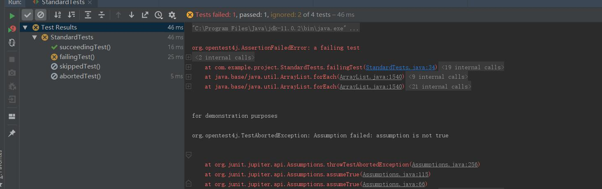
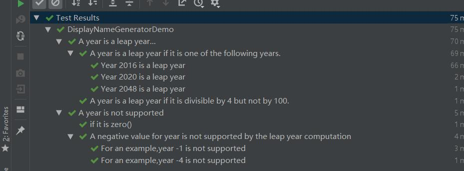
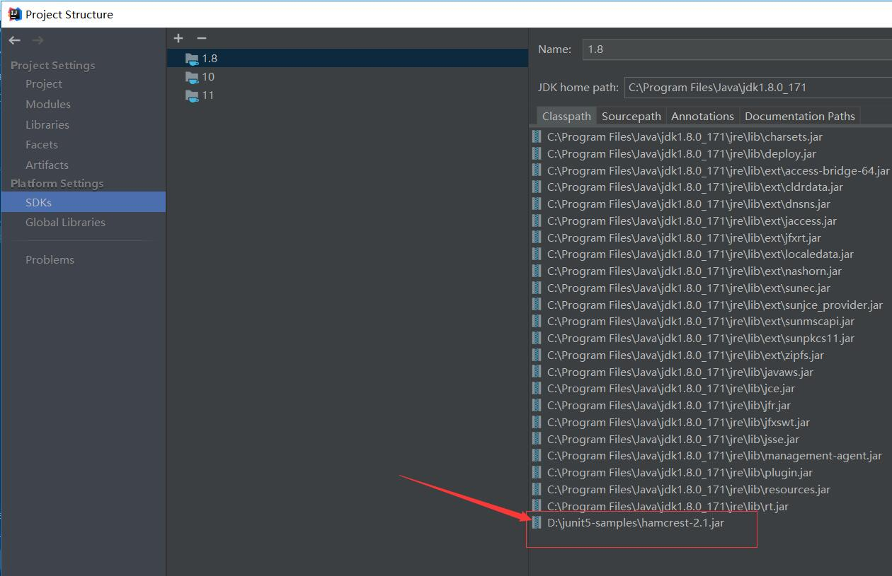

# Junit5
___
> 本文译自[junit5/docs/current/user-guide](https://junit.org/junit5/docs/current/user-guide/)

## 1、 回顾

### 1.1 什么是JUnit5
与之前的版本不同，JUnit5 由三个不同的子模块组合而成。

## JUnit 5 = JUnit Platform + JUnit Jupiter + JUnit Vintage ##

**JUnit Platform** : 作为在JVM 上启动测试框架的基础。它还定义了 TestEngine API，用于 开发在平台上运行的测试框架。该平台提供了一个控制台启动器，用于从命令行启动平台，以及一个基于JUnit 4的运行器，用于在基于JUnit 4的环境中运行平台上的任何TestEngine。

**JUnit Jupiter**： 是用于在JUnit5中编写测试和扩展的新编程模型和扩展模型的组合。Jupiter子项目为在平台上运行基于Jupiter的测试提供了一个测试引擎。

**JUnit Vintage**: 提供一个用于在平台上运行基于JUnit 3和JUnit 4的测试引擎。
### 1.2 支持的Java版本
Java 8 或者更高。然而，你也可以测试以前版本的JDK
### 1.3 开始
[github link](https://github.com/junit-team/junit5-samples)
## 2、 编写测试
第一个测试用例：
```
	public static void assertEquals(int expected, int actual, String message) {
		AssertEquals.assertEquals(expected, actual, message);
	}
```

```
package com.example.project;

import org.junit.jupiter.api.Test;
import static org.junit.jupiter.api.Assertions.assertEquals;
public class FirstDemo {
    private final Calculator calculator = new Calculator();
    @Test
    void addTest()
    {
        assertEquals(3,calculator.add(1,1),"1 + 1 should be equal 2");
    }
}

output:
org.opentest4j.AssertionFailedError: 1 + 1 should be equal 2 ==> 
Expected :3
Actual   :2


```
### 2.1 注解 Annotations
|注解    |描述|
|:---------------- |:------------------------
|@Test| 表示该方法是测试方法。不像JUnit4的@Test注解，这个注解并不会声明任何属性，因为JUnit |Jupiter中的测试扩展是基于它们自己专用的注解进行操作的。除非重写这个方法，否则它们将被继承
|@ParameterizedTest |表示这个方法是参数化测试。除非重写这个方法，否则它们将被继承的
|@RepeatedTest| 表示这个方法是用于重复测试的测试模板。除非重写这个方法，否则它们将被继承
|@TestFactory|表示该方法是用于动态测试的测试工厂。除非重写这个方法，否则它们将被继承
|@TestTemplate|表示该方法是测试用例的模板，设计为可多次调用，调用的次数取决于由注册提供者返回的调用上下文的数量
|@TestMethodOrder|用于对注解测试类配置测试方法的执行顺序；类似于JUnit4 的@FixMethodOrder. 这样的注解是被继承的
|@TestInstance|用于为带注解的测试类配置测试实例生命周期。这样的注解是被继承的
|@DisplayName|用于对测试类或者测试方法声明一个自定义的显示名称。此类注解不被继承
|@DisplayNameGeneration|用于对测试类声明一个自定义的显示名称生成器。此类注解被继承
|@BeforeEach|表示该注解方法应该在**每一个**当前类的@Test, @RepeatedTest, @ParameterizedTest 或者 @TestFactory方法前执行；类似与JUnit4 的@Before。除非被重写，否则此方法被继承。
|@AfterEach|表示该注解方法应该在**每一个**当前类的@Test, @RepeatedTest, @ParameterizedTest 或者 @TestFactory方法后执行；类似与JUnit4 的@After。除非被重写，否则此方法被继承。
|@BeforeAll|表示该注解方法应该在**所有**当前类的@Test, @RepeatedTest, @ParameterizedTest, 和 @TestFactory 方法前执行；类似与JUnit4的@BeforeClass。此类方法是被继承的（除非被重写或隐藏）而且必须是静态方法（除非使用了“per-class" 测试实例声明周期）
|@AfterAll|表示该注解方法应该在**所有**当前类的@Test, @RepeatedTest, @ParameterizedTest, 和 @TestFactory 方法后执行；类似与JUnit4的@AfterClass。此类方法是被继承的（除非被重写或隐藏）而且必须是静态方法（除非使用了“per-class" 测试实例声明周期
|@Nested|表示该注解类是非静态的嵌套测试类。@BeforeAll和@AfterAll方法不能直接在@嵌套测试类中使用，除非使用了“per-class”测试实例生命周期。此类注解不被继承。
|@Tag|用于声明过滤测试标签，在类或者方法级别；类似于JUnit4 中的TestNG 测试组 或者Categories
|@Disabled|用于禁用一个测试类或者测试方法；类似与JUnit4 的@Ignore。此类注解不被继承
|@ExtendWith|用于以声明方式注册扩展。此类注解被继承。
|@RegisterExtension|用于通过字段一编程方式注册扩展。此类字段被继承，除非它们被遮蔽。
|@TempDir|用于在生命周期方法或测试方法中通过字段注入或参数注入提供临时目录;位于org.junit.jupiter.api.io 包内

### 2.1.1 元注解与复合注解
JUnit Jupiter 注解可以用作元注解。这意味着你可以定义自己的复合注解---将自动继承其元注释的语义。
举个例子，你可以新建一个自定义的如下注解@Fast，来替代通篇的复制和粘贴@Tag(“Fast”)。@Fast 可以看作一个插入式替换@Tag("fast")

```java
import java.lang.annotation.ElementType;
import java.lang.annotation.Retention;
import java.lang.annotation.RetentionPolicy;
import java.lang.annotation.Target;

import org.junit.jupiter.api.Tag;

@Target({ ElementType.TYPE, ElementType.METHOD })
@Retention(RetentionPolicy.RUNTIME)
@Tag("fast")
public @interface Fast {
}

```
如下@Test 方法描述了@Fast 注解的使用
```java

@Fast
@Test
void myFastTest() {
    // ...
}
```
当然你甚至可以更近一步通过引入自定义的@FastTest 注解-- 可用作插入式替换@Tag("fast") 和@Test。
```java
import java.lang.annotation.ElementType;
import java.lang.annotation.Retention;
import java.lang.annotation.RetentionPolicy;
import java.lang.annotation.Target;

import org.junit.jupiter.api.Tag;
import org.junit.jupiter.api.Test;

@Target(ElementType.METHOD)
@Retention(RetentionPolicy.RUNTIME)
@Tag("fast")
@Test
public @interface FastTest {

}
```
JUnit 会自动识别下面的方法为@Test 方法并且这个方法别标记为"fast"。
```java
@FastTest
void myFastTest() {
    // ...
}
```


### 2.2 测试类与方法 Test Classes and Methods
**测试类** ： 任何顶级类，静态成员类或者@Nest 类 ->至少包含一个测试方法。测试类不能为抽象类，必须又一个构造函数

**测试方法** ：任何以@Test,@RepeatedTest，@ParameterizedTest，@TestFactory,@TestTemplate 注解或者元注解的实例方法

**生命周期方法** ：直接用@BeforeAll、@AfterAll、@BeforeEach或@AfterEach注解或元注解的任何方法

测试方法和生命周期方法可以在当前测试类内部声明，或者继承自父类，或者继承自接口。除此之外，测试方法和生命周期方法必须不是抽象方法而且不能有返回值
> 测试类，测试方法和生命周期方法不要求用public 修饰符修饰，但是他们不能用private修饰

示例测试类：
```java
package com.example.project;

import org.junit.jupiter.api.*;

import static org.junit.jupiter.api.Assertions.fail;
import static org.junit.jupiter.api.Assumptions.assumeTrue;

public class StandardTests {

    @BeforeAll
    public static void initAll(){

    }

    @BeforeEach
    public void init()
    {

    }

    @Test
    public void succeedingTest()
    {

    }

    @Test
    public void failingTest(){
        // fail information
        fail("a failing test");
    }

    @Test
    @Disabled("for demonstration purposes")
    public void skippedTest(){
        // not executed,since this method was disabled
    }

    @Test
    public void abortedTest(){
        assumeTrue("abc".contains("z"));
        fail("test should have been aborted");
    }

    @AfterEach
    public void tearDown(){}

    @AfterAll
    public static void tearDownAll(){}

}

```

<div align="center">  </div><br>

### 2.3 显示名称 Display Names
测试类或者测试方法可以通过@DisplayName声明自定义的显示名称,该名称可以是空格，特殊字符，甚至emojis，这将在测试报告中以及测试运行器和ide中显示。

```java
import org.junit.jupiter.api.DisplayName;
import org.junit.jupiter.api.Test;

@DisplayName("A special test case")
class DisplayNameDemo {

    @Test
    @DisplayName("Custom test name containing spaces")
    void testWithDisplayNameContainingSpaces() {
    }

    @Test
    @DisplayName("╯°□°）╯")
    void testWithDisplayNameContainingSpecialCharacters() {
    }

    @Test
    @DisplayName("😱")
    void testWithDisplayNameContainingEmoji() {
    }

}
```
### 2.3.1 显示名称生成器 Display Name Generators

JUnit Jupiter 支持自定义的显示名称生成器--可以通过@DisplayNameGeneration 注解配置。通过@DisplayName注释提供的值总是优先于DisplayNameGenerator生成的显示名称
```java
package com.example.project;

import org.junit.jupiter.api.DisplayName;
import org.junit.jupiter.api.DisplayNameGeneration;
import org.junit.jupiter.api.DisplayNameGenerator;
import org.junit.jupiter.api.Nested;
import org.junit.jupiter.api.Test;
import org.junit.jupiter.params.ParameterizedTest;
import org.junit.jupiter.params.provider.ValueSource;

import java.lang.reflect.Method;

public class DisplayNameGeneratorDemo {
    @Nested
    @DisplayNameGeneration(DisplayNameGenerator.ReplaceUnderscores.class)
    class A_year_is_not_supported{
        @Test
        void if_it_is_zero(){}

        @DisplayName("A negative value for year is not supported by the leap year computation")
        @ParameterizedTest(name = "For an example,year {0} is not supported")
        @ValueSource(ints = {-1,-4})
        void if_it_is_negative(int year){}
    }

    @Nested
    @DisplayNameGeneration(IndicativeSentences.class)
    class A_year_is_a_leap_year{
        @Test
        void if_it_is_divisible_by_4_but_not_by_100(){}

        @ParameterizedTest(name = "Year {0} is a leap year")
        @ValueSource(ints = {2016,2020,2048})
        void if_it_is_one_of_the_following_years(int year)
        {

        }
    }


    static class IndicativeSentences extends DisplayNameGenerator.ReplaceUnderscores {

        @Override
        public String generateDisplayNameForClass(Class<?> testClass) {
            return super.generateDisplayNameForClass(testClass);
        }

        @Override
        public String generateDisplayNameForNestedClass(Class<?> nestedClass) {
            return super.generateDisplayNameForNestedClass(nestedClass) + "...";
        }

        @Override
        public String generateDisplayNameForMethod(Class<?> testClass, Method testMethod) {
            String name = testClass.getSimpleName() + ' ' + testMethod.getName();
            return name.replace('_', ' ') + '.';
        }

    }
}

```
<div align="center">  </div><br>


### 2.4 断言 Assertions
JUnit Jupiter 附带了JUnit 4所具有的许多断言方法，并添加了一些适合与Java 8 lambdas一起使用的断言方法。所有的JUnit Jupiter [org.junit.jupiter.api.Assertions](https://junit.org/junit5/docs/current/api/org/junit/jupiter/api/Assertions.html) 中的静态方法

```java
package com.example.project;

import org.junit.jupiter.api.Test;

import java.time.Duration;

import static org.junit.jupiter.api.Assertions.*;

public class AssertionsDemo {
    private final Calculator calculator = new Calculator();
    private final Person person = new Person("Jane", "Doe");

    @Test
    public void standardAssertions() {
        assertEquals(2, calculator.add(1, 1));
        assertEquals(4, calculator.multiply(2, 2), "The optional failure message");
        assertTrue('a' < 'b', () -> "Assertion messages can be lazily evaluated -- "
                + "to avoid constructing complex messages unnecessarily.");

    }

    @Test
    public void groupAssertions() {

        // In a grouped assertion all assertions are executed, and all
        // failures will be reported together.
        assertAll("person",
                () -> assertEquals("Jane", person.getFirstName()),
                () -> assertEquals("Doe", person.getLastName()));
    }

    @Test
    public void dependentAssertions() {

        // Within a code block, if an assertion fails the
        // subsequent code in the same block will be skipped.
        assertAll("properties",
                () -> {
                    String firstName = person.getFirstName();
                    assertNotNull(firstName);
                    assertAll("firstName",
                            () -> assertTrue(firstName.startsWith("J")),
                            () -> assertTrue(firstName.endsWith("e")));
                },
                () -> {
                    // Grouped assertion, so processed independently
                    // of results of first name assertions.
                    String lastName = person.getLastName();
                    assertNotNull(lastName);

                    // Executed only if the previous assertion is valid.
                    assertAll("last name",
                            () -> assertTrue(lastName.startsWith("D")),
                            () -> assertTrue(lastName.endsWith("e"))
                    );
                });
    }

    @Test
    public void ExceptionTesting() {
        Exception exception = assertThrows(ArithmeticException.class, () -> calculator.divide(1, 0));
        assertEquals("/ by zero", exception.getMessage());
    }

    @Test
    public void timeoutNotExceed() {
        // the following assertion succeeds
        assertTimeout(Duration.ofMinutes(2), () -> {
            // Perform task that takes less than 2 minutes.
        });
    }

    @Test
    public void timeoutNotExceededWithResult() {
        String result = assertTimeout(Duration.ofMinutes(2), () -> "a result");
        assertEquals("a result", result);
    }

    @Test
    public void timeoutNotExceededWithMethod()
    {
        String greeting = assertTimeout(Duration.ofMinutes(2), AssertionsDemo::greeting);
        assertEquals("Hello, World!", greeting);
    }

    @Test
    public void timeoutExceeded()
    {
        assertTimeout(Duration.ofMillis(10), () ->  Thread.sleep(100));

    }


    private static String greeting()
    {
        return "Hello, World!";
    }

}

```
### 2.4.1 Kotlin Assertion 支持
JUnit Jupiter 还附带了一些新的适用于Kotlin 的断言方法。所有的Kotlin 断言是org.junit.jupiter.api 包中的顶级函数。
```java
import example.domain.Person
import example.util.Calculator

import org.junit.jupiter.api.Test
import org.junit.jupiter.api.assertAll
import org.junit.jupiter.api.Assertions.assertEquals
import org.junit.jupiter.api.Assertions.assertTrue
import org.junit.jupiter.api.assertThrows

class KotlinAssertionsDemo {

    val person = Person("Jane", "Doe")
    val people = setOf(person, Person("John", "Doe"))

    @Test
    fun `expected exception testing`() {
        val calculator = Calculator()
        val exception = assertThrows<ArithmeticException> ("Should throw an exception") {
            calculator.divide(1, 0)
        }
        assertEquals("/ by zero", exception.message)
    }

    @Test
    fun `grouped assertions`() {
        assertAll("Person properties",
            { assertEquals("Jane", person.firstName) },
            { assertEquals("Doe", person.lastName) }
        )
    }

    @Test
    fun `grouped assertions from a stream`() {
        assertAll("People with first name starting with J",
            people
                .stream()
                .map {
                    // This mapping returns Stream<() -> Unit>
                    { assertTrue(it.firstName.startsWith("J")) }
                }
        )
    }

    @Test
    fun `grouped assertions from a collection`() {
        assertAll("People with last name of Doe",
            people.map { { assertEquals("Doe", it.lastName) } }
        )
    }
}
```
### 2.4.2 第三方断言库
尽管JUnit Jupiter 提供了对很多测试场景都足够高效的断言工具，但有时需要更多的强大功能和附加功能，比如matchers。在这些场景，JUnit 团队推荐使用第三方断言库例如：[AssertJ](https://joel-costigliola.github.io/assertj/), [Hamcrest](https://hamcrest.org/JavaHamcrest/), [Truth](https://google.github.io/truth/) 等。因此开发者可以根据自己下需求自由的选择断言库
例如，匹配器matchers和Fluent API的组合可用于使断言更具描述性和可读性。然而，JUnit Jupiter的 org.junit.jupiter.api.Assertions 类并没有提供类似于JUnit 4中接收Hamcrest Matchers 的AssertThat() 方法。 相反，我们鼓励开发者使用第三方断言库提供的内建mathcher
以下例子阐述了如何在Junit Jupiter 测试中使用Hamcrest 的assertThat() 方法。只要Hamcrest库已经被添加到了classpath, 你可以静态导入assertThat(), is()和 equalTo()，并且像如下assertWithHamcrestMatcher() 的方法中使用它们。

将Hamcrest库添加到了classpath
<div align="center">  </div><br>


```java
package com.example.project;

import org.junit.jupiter.api.Test;
import static org.hamcrest.CoreMatchers.equalTo;
import static org.hamcrest.CoreMatchers.is;
import static org.hamcrest.MatcherAssert.assertThat;

public class HamcrestAssertionsDemo {

    private final Calculator calculator = new Calculator();

    @Test
    public void assertWithHamcrestMatcher()
    {
        assertThat(calculator.substract(4,1), is(equalTo(3)));
    }

}
```
当然，基于JUnit 4编程模型的遗留测试可以继续使用org.junit.Assert#assertThat。


### 2.5 假设 Assumptions 
JUnit Jupiter附带了JUnit 4中假设方法的一个子集，并新增了一些适用于Java 8 Lambda 表达式与方法引用的函数。所有的JUnit Jupiter 假设都是 org.junit.jupiter.api.Assumptions 类中的静态方法。

```java
package com.example.project;

import org.junit.jupiter.api.Test;

import static org.junit.jupiter.api.Assertions.assertEquals;
import static org.junit.jupiter.api.Assumptions.assumeTrue;
import static org.junit.jupiter.api.Assumptions.assumingThat;

public class AssumptionsDemo {

    private final Calculator calculator = new Calculator();

    @Test
    public void testOnlyOnCiServer()
    {
        assumeTrue("CI".equals(System.getenv("ENV")));
        //
    }

    @Test
    public void testOnlyOnDeveloperWorkstation()
    {
        assumeTrue("DEV".equals(System.getenv("ENV")), () -> "Aborting test: not on developer workstation");
    }

    @Test
    public void testInAllEnvironments()
    {
        assumingThat("CI".equals(System.getenv("ENV")),
                // perform these assertions only on the CI server
                () -> assertEquals(2, calculator.divide(4,2))
                );
        // perform these assertions in all environments
        assertEquals(42, calculator.multiply(6,7));

    }
}

```
> 对于JUnit Jupiter 5.4, 可以使用 JUnit 4  org.junit.Assume 类中的假设方法。 具体地说，JUnit Jupiter支持JUnit 4的AssumptionViolatedException，以指示应该中止测试，而不是将其标记为失败。

### 2.6 禁用测试 Disabling Tests
整个测试类或者测试方法都可以通过@Disabled 注解， Conditional Test Execution 中讨论的注解或者自定义的 [ExecutionCondition](https://junit.org/junit5/docs/current/user-guide/#extensions-conditions) 来禁用。

一个@Disabled 测试类
```java
package com.example.project;

import org.junit.jupiter.api.Disabled;
import org.junit.jupiter.api.Test;

@Disabled("Disabled until bug #99 has been fixed")
public class DisabledClassDemo {
    @Test
    public void testWillBeSkipped(){}
}

```

以下是包含@Disabled 方法的测试类
```java
package com.example.project;

import org.junit.jupiter.api.Disabled;
import org.junit.jupiter.api.Test;

public class DisabledTestsDemo {
    @Disabled("Disabled until bug #100 has been fixed")
    @Test
    public void testWillBeSkipped()
    {
        // this test case will be skipped
    }

    @Test
    public void testWillBeExecuted()
    {
        // this test case will be executed
    }
}

```
> @Disabled 可以在不提供理由的情况下声明；但是，JUnit  团队推荐开发者提供一个简短的解释为什么这个测试类或者测试方法被禁用了。因此，上述示例都提供了禁用的理由--例如：@Disabled("Disabled until bug #100 has been resolved")。一些开发团队甚至需要问题跟踪编号，以实现自动跟踪，等等。

### 2.7 条件测试执行 Conditional Test Execution
JUnit Jupiter 中的 ExecutionCondition 扩展API 允许开发者启用或者禁用一个容器 或者以编程方式基于特定条件测试。最简单的内建的一个条件是DisabledCondition，它支持@Disabled注解，除了@Disabled， JUnit Jupiter 同样还支持org.junit. api中的其他几个基于注解的条件，允许开发人员以声明的方式启用或禁用容器和测试。详情请看以下部分。
> **复合注解** 请注意，为了创建自定义复合注解释，以下部分中列出的任何条件注解也可以用作元注解。例如，@EnabledOnOs演示中的@TestOnMac注解展示了如何在单个可重用注解中组合@Test和@EnabledOnOs。
> 以下部分的每个条件注解只可以在指定的测试接口，测试类或者测试方法中声明一次。如果条件注解在给定元素上直接、间接或元呈现多次，则只使用JUnit发现的第一个条件注解;任何额外的声明都会默认被忽略掉。注意，每个条件注解可以与 org.junit.jupiter.api.condition 包中的其他条件注解联合使用。
### 2.7.1 操作系统条件 Operating System Conditions

通过@EnabledOnOs 与@DisabledOnOs 注解，可以是一个容器或者测试在特定的操作系统上 被启用或者禁用。
```java
package com.example.project;

import org.junit.jupiter.api.Test;
import org.junit.jupiter.api.condition.EnabledOnOs;
import org.junit.jupiter.api.condition.OS;

import java.lang.annotation.ElementType;
import java.lang.annotation.Retention;
import java.lang.annotation.RetentionPolicy;
import java.lang.annotation.Target;

@Target(ElementType.METHOD)
@Retention(RetentionPolicy.RUNTIME)
@Test
@EnabledOnOs(OS.MAC)
public @interface TestOnMac {
}

```

```java
package com.example.project;

import org.junit.jupiter.api.Test;
import org.junit.jupiter.api.condition.DisabledOnOs;
import org.junit.jupiter.api.condition.EnabledOnOs;
import org.junit.jupiter.api.condition.OS;

public class EnabledOnOsDemo {

    @Test
    @EnabledOnOs(OS.MAC)
    public void onlyOnMacOs()
    {
        // only work on mac os
    }

    // combine @Test and @EnabledOnOs
    @TestOnMac
    public void testOnMacOs()
    {
        // only work on mac os
    }

    @Test
    @EnabledOnOs({OS.LINUX,OS.MAC})
    public void testOnLinuxOrMac()
    {
        // work on linux or Mac
    }
    @Test
    @DisabledOnOs(OS.WINDOWS)
    public void disabledOnWindows()
    {
        // not work on windows
    }
}

```

### 2.7.2 Java  运行环境条件 Java Runtime Environment Conditions
通过@EnabledOnJre 与@DisabledOnJre注解，可以使一个容器或者测试在特定的运行环境上被启用或者禁用。
```java
package com.example.project;

import org.junit.jupiter.api.Test;
import org.junit.jupiter.api.condition.DisabledOnJre;
import org.junit.jupiter.api.condition.EnabledOnJre;
import org.junit.jupiter.api.condition.JRE;


public class TestOnJRE {
    
    @Test
    @EnabledOnJre(JRE.JAVA_8)
    public void onlyOnJava8()
    {
        
    }
    
    @Test
    @EnabledOnJre({JRE.JAVA_8,JRE.JAVA_9})
    public void onJava8AndJava9()
    {
        
    }
    
    @Test
    @DisabledOnJre(JRE.JAVA_9)
    public void notOnJava9()
    {
        
    }
    
}

```

### 2.7.3 系统属性条件 System Property Conditions
通过@EnabledIfSystemProperty 和 @DisabledIfSystemProperty 注解，可以根据JVM 的系统属性的使一个容器或者测试值来启用或者禁用。通过matches属性提供的值将被解释为正则表达式。

```java
package com.example.project;

import org.junit.jupiter.api.Test;
import org.junit.jupiter.api.condition.DisabledIfSystemProperty;
import org.junit.jupiter.api.condition.EnabledIfSystemProperty;

public class SystemPropertyConditionsDemo {
    
    @Test
    @EnabledIfSystemProperty(named = "os.arch", matches = ".*64.*")
    public void onlyOn64BitArchitectures(){}
    
    @Test
    @DisabledIfSystemProperty(named = "ci-server", matches = "true")
    public void notOnCiServer(){}
}

```
### 2.7.3 环境变量条件 Environment Variable Conditions
通过@EnabledIfEnvironmentVariable 和 @DisabledIfEnvironmentVariable 注解，根据底层操作系统的环境变量的值，可以使一个容器或者测试被启用或者禁用。通过matcher属性提供的值将被解释为正则表达式。


```java
@Test
@EnabledIfEnvironmentVariable(named = "ENV", matches = "staging-server")
void onlyOnStagingServer() {
    // ...
}

@Test
@DisabledIfEnvironmentVariable(named = "ENV", matches = ".*development.*")
void notOnDeveloperWorkstation() {
    // ...
}
```
### 2.7.5. 基于脚本的条件 Script-based Conditions

JUnit Jupiter 通过@EnabledIf 或者 @DisabledIf 注解配置的脚本的值，提供了启用或禁用容器或测试的能力。脚本可以用JavaScript、Groovy或任何支持Java脚本API(由JSR 223定义)的其他脚本语言编写。

> 通过@EnabledIf和@DisabledIf执行条件测试目前是一个实验性特性。有关详细信息，请参考实验api中的表格。

```java
@Test // Static JavaScript expression.
@EnabledIf("2 * 3 == 6")
void willBeExecuted() {
    // ...
}

@RepeatedTest(10) // Dynamic JavaScript expression.
@DisabledIf("Math.random() < 0.314159")
void mightNotBeExecuted() {
    // ...
}

@Test // Regular expression testing bound system property.
@DisabledIf("/32/.test(systemProperty.get('os.arch'))")
void disabledOn32BitArchitectures() {
    assertFalse(System.getProperty("os.arch").contains("32"));
}

@Test
@EnabledIf("'CI' == systemEnvironment.get('ENV')")
void onlyOnCiServer() {
    assertTrue("CI".equals(System.getenv("ENV")));
}

@Test // Multi-line script, custom engine name and custom reason.
@EnabledIf(value = {
                "load('nashorn:mozilla_compat.js')",
                "importPackage(java.time)",
                "",
                "var today = LocalDate.now()",
                "var tomorrow = today.plusDays(1)",
                "tomorrow.isAfter(today)"
            },
            engine = "nashorn",
            reason = "Self-fulfilling: {result}")
void theDayAfterTomorrow() {
    LocalDate today = LocalDate.now();
    LocalDate tomorrow = today.plusDays(1);
    assertTrue(tomorrow.isAfter(today));
}

```

### 2.8 标记和过滤 Tagging and Filtering
测试类和方法可以通过@Tag注释进行标记。这些标记稍后可以用来过滤测试发现和执行。
### 2.8.1. Syntax Rules for Tags
- 标记不为null 或者空白
- 修剪（trimmed）后的标记不能包含空格
- 裁剪后的标签不能包含ISO控制字符
- 修剪后的标记不能包含以下任何保留字符：
   
1. ,: comma
2. (: left parenthesis
3. ): right parenthesis
4. &: ampersand
5. |: vertical bar
6. !: exclamation point
> 在上面的上下文中，“修剪”意味着前面和后面的空格字符已经被删除。

```java
import org.junit.jupiter.api.Tag;
import org.junit.jupiter.api.Test;

@Tag("fast")
@Tag("model")
class TaggingDemo {

    @Test
    @Tag("taxes")
    void testingTaxCalculation() {
    }

}
```

### 2.9 测试执行顺序 Test Execution Order
默认情况下，测试方法使用的算法是确定性的，除了故意不明显。这确保测试套件的后续运行以相同的顺序执行测试方法，从而允许可重复的构建。

尽管真正的单元测试不应该依赖于他们执行的顺序，但有时需要强制指定特定测试方法的执行顺序。例如，当编写集成测试或功能测试时，其中测试序列非常重要，特别是与@TestInstance(Lifecycle.PER_CLASS)结合使用时。

为了控制测试方法执行的顺序，可用@TestMethodOrder 注解你的测试类或者测试接口，并指定所需的MethodOrderer实现。你可以实现自定义的MethodOrderer 或者使用以下内建的MethodOrderer 实现:
- Alphanumeric ：根据测试方法的名称和形式参数列表对测试方法进行字母数字排序。
- OrderAnnotation： 根据@Order  注解指定的数值，来对测试方法进行数值排序。
- Random : 支持配置自定义种子和伪随机排序测试方法。
> 参见： [Wrapping Behavior of Callbacks](https://junit.org/junit5/docs/current/user-guide/#extensions-execution-order-wrapping-behavior)

下面的示例演示了如何确保测试方法按照@Order注解指定的顺序执行。

```java
package com.example.project;

import org.junit.jupiter.api.MethodOrderer;
import org.junit.jupiter.api.Order;
import org.junit.jupiter.api.Test;
import org.junit.jupiter.api.TestMethodOrder;


@TestMethodOrder(MethodOrderer.OrderAnnotation.class)
public class OrderDemo {

    @Test
    @Order(3)
    void validValues()
    {
        System.out.println("Order 3");
    }

    @Test
    @Order(2)
    public void emptyValues()
    {
        System.out.println("Order 2");
    }

    @Test
    @Order(1)
    public void nullValues()
    {
        System.out.println("Order 1");
    }
}

```

``` html
output:
Order 1
Order 2
Order 3
```

### 2.10 测试实例生命周期 Test Instance Lifecycle
为了允许单独的测试方法独立执行，并避免由于可变的测试实例状态而产生的意外副作用，JUnit 在这姓每个测试方法前新建了每个类的实例。这种“Per-Method”的测试实例生命周期是JUnit Jupiter中的默认行为，类似于JUnit以前的所有版本。
> 请注意，如果通过一个条件(例如@Disabled， @DisabledOnOs，等等)禁用了给定的测试方法，即使“Per-Method”测试实例生命周期模式是活动的，测试类仍然会被实例化。

如果你想要JUnit Jupiter 在同一个实例上执行所有的测试方法，可用 **@TestInstance(Lifecycle.PER_CLASS)** 注解你的测试类。当使用这种模式的时候，对每个测试类，只会新建一个测试实例。因此，如果你的测试方法依赖存储在实例变量内的状态，需要你在@BeforeEach 或者@AfterEach 方法内重置实例的状态。

“Per-Class”模式比默认的“Per-Method”模式有一些额外的好处。具体来说，使用“Per-Class类”模式，可以在非静态方法和接口默认方法上声明@BeforeAll和@AfterAll。因此，“Per-Class”模式还允许在@Nested测试类中使用@BeforeAll和@AfterAll方法。

如果您使用Kotlin编程语言编写测试，您可能还会发现通过切换到“Per-Class”测试实例生命周期模式，更容易实现@BeforeAll和@AfterAll方法。

### 2.10.1. 更改默认测试实例生命周期 Changing the Default Test Instance Lifecycle

#### On JVM
启动JVM 时添加以下参数，可以将默认的测试实例生命周期模式更改为Lifecycle.PER_CLASS
-Djunit.jupiter.testinstance.lifecycle.default=per_class

#### JUnit Platform configuration file

通过JUnit Platform 配置文件可以更改默认模式为"Per-Class"，在类路径的根目录中(例如，src/test/resources)，创建一个名为junit-platform.properties 的配置文件。具有以下内容

junit.jupiter.testinstance.lifecycle.default = per_class

>  如果不一致地应用，更测试实例改默认的生命周期模式会导致不可预测的结果和脆弱的构建。例如，如果构建将“Per-Class”语义配置为默认值，但是IDE中的测试使用“Per-Class”语义执行，那么将很难调试在构建服务器上发生的错误。因此，建议更改JUnit平台配置文件中的缺省值，而不是通过JVM系统属性。


### 2.11 嵌套测试 Nested Tests
@嵌套测试为测试作者提供了更多的能力来表达几组测试之间的关系。以下时一个详细的例子。

测试一个栈的嵌套测试套件

```java

package com.example.project;

import org.junit.jupiter.api.BeforeEach;
import org.junit.jupiter.api.DisplayName;
import org.junit.jupiter.api.Nested;
import org.junit.jupiter.api.Test;

import java.util.EmptyStackException;
import java.util.Stack;

import static org.junit.jupiter.api.Assertions.*;

/**
 * @author: shenhaizhilong
 * @date: 2019/2/15 10:36
 */

@DisplayName("a stack")
public class TestingAStackDemo {
    private Stack<Object> stack;
    @Test
    @DisplayName("实例化")
    public void isInstantiatedWithNew()
    {
        stack = new Stack<>();
    }

    @Nested
    @DisplayName("when new")
    class WhenNew{
        @BeforeEach
        public void createNewStack()
        {
            stack = new Stack<>();
        }

        @Test
        @DisplayName("is empty")
        public void isEmpty()
        {
            assertTrue(stack.isEmpty());
        }

        @Test
        @DisplayName("throws EmptyStackException when popped")
        public void throwsExceptionWhenPopped()
        {
            assertThrows(EmptyStackException.class, stack::pop);
        }

        @Test
        @DisplayName("throws EmptyStackException when peeked")
        public void throwsExceptionWhenPeeked()
        {
            assertThrows(EmptyStackException.class, stack::peek);
        }

        @Nested
        @DisplayName("after pushing an element")
        class AfterPushing{
            String anElement = "an element";
            @BeforeEach
            public void pushAnElement()
            {
                stack.push(anElement);
            }

            @Test
            @DisplayName("it is no long empty")
            public void isNotEmpty()
            {
                assertFalse(stack.isEmpty());
            }

            @Test
            @DisplayName("returns the element when popped and is empty")
            public void returnElementWhenPopped()
            {
                assertEquals(anElement, stack.pop());
                assertTrue(stack.isEmpty());
            }

            @Test
            @DisplayName("returns the element when peeked but remains not empty")
            void returnElementWhenPeeked() {
                assertEquals(anElement, stack.peek());
                assertFalse(stack.isEmpty());
            }
        }

    }


}


```
只有非静态嵌套类(即内部类)才能充当@Nest 测试类。嵌套可以是任意深度的，这些内部类被认为是测试类家族的完整成员，只有一个例外:@BeforeAll和@AfterAll方法在默认情况下不工作。原因是Java不允许内部类中的静态成员。但是，可以通过用@TestInstance(Lifecycle.PER_CLASS)注解@Nest测试类(参见测试实例生命周期)来绕过这个限制。


### 2.12 构造器与方法的依赖注入 Dependency Injection for Constructors and Methods

在所有之前的JUnit版本中，测试构造函数或方法都不允许有参数(至少在标准的Runner实现中不允许)。作为JUnit Jupiter的主要变化之一，测试构造函数和方法现在都允许具有参数。这允许更大的灵活性，并允许对构造函数和方法进行依赖注入。

ParameterResolver为希望在运行时动态解析参数的测试扩展定义API。如果测试类构造函数、测试方法或生命周期方法(请参阅测试类和方法)接受参数，则必须在运行时由注册的ParameterResolver解析该参数。

目前有三个内置的自动注册解析器。
- **TestInfoParameterResolver** : 如果构造函数或方法参数的类型是TestInfo, TestInfoParameterResolver将提供一个TestInfo实例，该实例对应于当前容器或test作为参数的值。然后可以使用TestInfo检索关于当前容器或测试的信息，例如显示名称、测试类、测试方法和相关标记。显示名称可以是技术名称，例如测试类或测试方法的名称，也可以是通过@DisplayName配置的自定义名称。

 TestInfo作为JUnit 4中的TestName规则的一个简易替代。下面演示了如何将TestInfo注入到测试构造函数@BeforeEach和@Test方法中。
 
 ```java
 
 import static org.junit.jupiter.api.Assertions.assertEquals;
import static org.junit.jupiter.api.Assertions.assertTrue;

import org.junit.jupiter.api.BeforeEach;
import org.junit.jupiter.api.DisplayName;
import org.junit.jupiter.api.Tag;
import org.junit.jupiter.api.Test;
import org.junit.jupiter.api.TestInfo;

@DisplayName("TestInfo Demo")
class TestInfoDemo {

    TestInfoDemo(TestInfo testInfo) {
        assertEquals("TestInfo Demo", testInfo.getDisplayName());
    }

    @BeforeEach
    void init(TestInfo testInfo) {
        String displayName = testInfo.getDisplayName();
        assertTrue(displayName.equals("TEST 1") || displayName.equals("test2()"));
    }

    @Test
    @DisplayName("TEST 1")
    @Tag("my-tag")
    void test1(TestInfo testInfo) {
        assertEquals("TEST 1", testInfo.getDisplayName());
        assertTrue(testInfo.getTags().contains("my-tag"));
    }

    @Test
    void test2() {
    }

}
```
- **RepetitionInfoParameterResolver**:如果@RepeatedTest、@BeforeEach或@AfterEach方法中的方法参数类型为RepetitionInfo，那么RepetitionInfoParameterResolver将提供一个RepetitionInfo实例。然后可以使用RepetitionInfo检索关于当前重复以及对应@RepeatedTest的重复总数的信息。但是，请注意，RepetitionInfoParameterResolver 没有在@RepeatedTest的上下文中注册。参见重复测试示例。
- **TestReporterParameterResolver**:如果构造函数或方法参数类型为TestReporter, TestReporterParameterResolver将提供TestReporter的实例。TestReporter可以用来发布关于当前测试运行的额外数据。数据可以通过TestExecutionListener中的reportingEntryPublished()方法使用，从而允许在ide中查看或包含在报告中。

在JUnit Jupiter中，可以使用TestReporter，在那里你可以将信息打印到JUnit 4中的stdout或stderr中。使用@RunWith(JUnitPlatform.class)将输出所有报告的条目到stdout。另外，一些IDE将报告条目打印到stdout中，或者在用户界面中显示测试结果。

```java
package com.example.project;

import org.junit.jupiter.api.Test;
import org.junit.jupiter.api.TestReporter;

import java.util.HashMap;
import java.util.Map;

public class TestReporterDemo {

    @Test
    public void reportSingleValue(TestReporter testReporter)
    {
        testReporter.publishEntry("a status message");
    }

    @Test
    public void reportKeyValuePair(TestReporter testReporter)
    {
        testReporter.publishEntry("a key", "a value");
    }

    @Test
    public void reportMultipleKeyValuePairs(TestReporter testReporter)
    {
        Map<String,String> map = new HashMap<>();
        map.put("user name", "tom");
        map.put("birth day", "1974.1.1");
        testReporter.publishEntry(map);
    }
}
```

```html
output:
timestamp = 2019-02-15T14:48:19.473, value = a status message
timestamp = 2019-02-15T14:48:19.490, user name = tom, birth day = 1974.1.1
timestamp = 2019-02-15T14:48:19.493, a key = a value
```
> 必须通过@ExtendWith注册适当的扩展来显式地启用其他参数解析器。

查看RandomParametersExtension作为自定义ParameterResolver的示例。虽然不准备用于生产，但它演示了扩展模型和参数解析过程的简单性和可表达性。MyRandomParametersTest演示了如何将随机值注入@Test方法。

对于真实的用例，请查看[MockitoExtension](https://github.com/mockito/mockito/blob/release/2.x/subprojects/junit-jupiter/src/main/java/org/mockito/junit/jupiter/MockitoExtension.java)和[SpringExtension](https://github.com/spring-projects/spring-framework/tree/master/spring-test/src/main/java/org/springframework/test/context/junit/jupiter/SpringExtension.java)的源代码。


### 2.13 测试接口与默认方法 Test Interfaces and Default Methods
JUnit Jupiter允许在接口默认方法上声明@Test、@RepeatedTest、@ParameterizedTest、@TestFactory、@TestTemplate、@BeforeEach和@AfterEach。@BeforeAll和@AfterAll既可以在测试接口中的静态方法上声明，也可以在使用@TestInstance(Lifecycle.PER_CLASS)注解的测试接口或测试类的接口默认方法上声明(参见测试实例生命周期)。这里有一些例子:
```java

package com.example.project;

import org.junit.jupiter.api.*;

import java.util.logging.Logger;


@TestInstance(TestInstance.Lifecycle.PER_CLASS)
public interface TestLifecycleLogger {

    static final Logger logger = Logger.getLogger(TestLifecycleLogger.class.getName());

    @BeforeAll
    default void beforeAllTests()
    {
        logger.info("Before all tests");
    }

    @AfterAll
    default void afterAllTests()
    {
        logger.info("After all tests");
    }

    @BeforeEach
    default void beforeEachTest(TestInfo testInfo)
    {
        logger.info( String.format("About to execute [%s]", testInfo.getDisplayName()));
    }

    @AfterEach
    default void afterEachTest(TestInfo testInfo) {
        logger.info(() -> String.format("Finished executing [%s]", testInfo.getDisplayName()));
    }

}

```

```java

interface TestInterfaceDynamicTestsDemo {

    @TestFactory
    default Stream<DynamicTest> dynamicTestsForPalindromes() {
        return Stream.of("racecar", "radar", "mom", "dad")
            .map(text -> dynamicTest(text, () -> assertTrue(isPalindrome(text))));
    }

}
```

可以在测试接口上声明@ExtendWith和@Tag，以便实现该接口的类自动继承其标记和扩展。有关TimingExtension的源代码，请参见测试执行回调之前和之后。

```java

@Tag("timed")
@ExtendWith(TimingExtension.class)
interface TimeExecutionLogger {
}
```


```java
package com.example.project;

import org.junit.jupiter.api.DynamicTest;
import org.junit.jupiter.api.Test;

import java.util.stream.Stream;

import static org.junit.jupiter.api.Assertions.assertEquals;

public class TestInterfaceDemo implements TestLifecycleLogger,TimeExecutionLogger,TestInterfaceDynamicTestsDemo {

    @Test
    public void isEqualValue()
    {
        assertEquals(1,"a".length(), "is always equal");
    }

    public static void main(String[] args) {
        TestInterfaceDemo demo = new TestInterfaceDemo();
        demo.dynamicTestsForPalindromes();
    }
}

```

运行TestInterfaceDemo的输出结果类似如下:

```html

月 15, 2019 5:46:14 下午 com.example.project.TestLifecycleLogger beforeAllTests
信息: Before all tests
二月 15, 2019 5:46:14 下午 com.example.project.TestLifecycleLogger beforeEachTest
信息: About to execute [dynamicTestsForPalindromes()]
二月 15, 2019 5:46:14 下午 org.junit.platform.launcher.core.InternalTestPlan add
警告: Attempt to modify the TestPlan was detected. A future version of the JUnit Platform will ignore this call and eventually even throw an exception. Please contact your IDE/tool vendor and request a fix (see https://github.com/junit-team/junit5/issues/1732 for details).
二月 15, 2019 5:46:14 下午 com.example.project.TimingExtension afterTestExecution
信息: Method [dynamicTestsForPalindromes] took 57 ms.
二月 15, 2019 5:46:14 下午 com.example.project.TestLifecycleLogger afterEachTest
信息: Finished executing [dynamicTestsForPalindromes()]

org.opentest4j.AssertionFailedError: 
Expected :<true> 
Actual   :<false>
 
```


这个特性的另一个可能的应用是为接口契约编写测试。例如，您可以为如何实现Object.equals 或者 Comparable.compareTo的行为测试应该是这样的：
```java
public interface Testable<T> {

    T createValue();

}

```
```java

public interface EqualsContract<T> extends Testable<T> {

    T createNotEqualValue();

    @Test
    default void valueEqualsItself() {
        T value = createValue();
        assertEquals(value, value);
    }

    @Test
    default void valueDoesNotEqualNull() {
        T value = createValue();
        assertFalse(value.equals(null));
    }

    @Test
    default void valueDoesNotEqualDifferentValue() {
        T value = createValue();
        T differentValue = createNotEqualValue();
        assertNotEquals(value, differentValue);
        assertNotEquals(differentValue, value);
    }

}
```

```java

public interface ComparableContract<T extends Comparable<T>> extends Testable<T> {

    T createSmallerValue();

    @Test
    default void returnsZeroWhenComparedToItself() {
        T value = createValue();
        assertEquals(0, value.compareTo(value));
    }

    @Test
    default void returnsPositiveNumberWhenComparedToSmallerValue() {
        T value = createValue();
        T smallerValue = createSmallerValue();
        assertTrue(value.compareTo(smallerValue) > 0);
    }

    @Test
    default void returnsNegativeNumberWhenComparedToLargerValue() {
        T value = createValue();
        T smallerValue = createSmallerValue();
        assertTrue(smallerValue.compareTo(value) < 0);
    }

}
```
在您的测试类中，您可以实现这两个契约接口，从而继承相应的测试。当然，您必须实现抽象方法。
```java

class StringTests implements ComparableContract<String>, EqualsContract<String> {

    @Override
    public String createValue() {
        return "banana";
    }

    @Override
    public String createSmallerValue() {
        return "apple"; // 'a' < 'b' in "banana"
    }

    @Override
    public String createNotEqualValue() {
        return "cherry";
    }

}
```

### 2.14 重复测试 Repeated Tests

JUnit Jupiter通过使用@RepeatedTest注解方法并指定所需的重复总数，从而提供了以指定次数重复测试的能力。重复测试的每次调用都像常规@Test方法的执行一样，完全支持相同的生命周期回调和扩展。

下面的示例演示如何声明一个名为RepeatedTest()的测试，该测试将自动重复10次。

```java

@RepeatedTest(10)
void repeatedTest() {
    // ...
}

```

除了指定重复的次数之外，还可以通过@RepeatedTest注解的name属性为每个重复测试配置自定义显示名称。此外，显示名称可以是由静态文本和动态占位符组合而成的模式。目前支持以下占位符。

- {displayName}:显示@RepeatedTest方法的名称
- {currentRepetition}:当前重复计数
- {totalRepetitions}:总重复次数

### 2.14.1. 重复测试示例 Repeated Test Examples

```java

package com.example.project;

import org.junit.jupiter.api.*;

import java.util.logging.Logger;

import static org.junit.jupiter.api.Assertions.assertEquals;


public class RepeatedTestsDemo {
    private Logger logger = Logger.getLogger(RepeatedTestsDemo.class.getName());

    @BeforeEach
    public void beforeEach(TestInfo testInfo, RepetitionInfo repetitionInfo )
    {
        int currentRepetition = repetitionInfo.getCurrentRepetition();
        int totalRepetitions = repetitionInfo.getTotalRepetitions();
        String methodName = testInfo.getTestMethod().get().getName();
        logger.info(String.format("execute repetition %d of %d for %s",currentRepetition, totalRepetitions, methodName));
    }

    @RepeatedTest(10)
    public void repeatedTest()
    {
        // do sth
    }

    @RepeatedTest(5)
    void repeatedTestWithRepetitionInfo(RepetitionInfo repetitionInfo) {
        assertEquals(5, repetitionInfo.getTotalRepetitions());
    }

    @RepeatedTest(value = 1, name = "{displayName} {currentRepetition}/{totalRepetitions}")
    @DisplayName("Repeat!")
    void customDisplayName(TestInfo testInfo) {
        assertEquals("Repeat! 1/1", testInfo.getDisplayName());
    }

    @RepeatedTest(value = 1, name = RepeatedTest.LONG_DISPLAY_NAME)
    @DisplayName("Details...")
    void customDisplayNameWithLongPattern(TestInfo testInfo) {
        assertEquals("Details... :: repetition 1 of 1", testInfo.getDisplayName());
    }

    @RepeatedTest(value = 8, name = "Wiederholung {currentRepetition} von {totalRepetitions}")
    void repeatedTestInGerman() {
        // ...
    }
}

```

### 2.15 参数化测试 Parameterized Tests

参数化测试使使用不同参数多次运行测试成为可能。它们像普通的@Test方法一样声明，但是使用@ParameterizedTest注解。此外，您必须声明至少一个源，该源将为每次调用提供参数，然后使用测试方法中的参数。

下面的示例演示了一个参数化测试，该测试使用@ValueSource注解指定字符串数组作为参数源。

```java

package com.example.project;

import org.junit.jupiter.params.ParameterizedTest;
import org.junit.jupiter.params.provider.ValueSource;
import static org.junit.jupiter.api.Assertions.assertTrue;

public class ParameterizedTestDemo1 {

    @ParameterizedTest
    @ValueSource(strings = { "racecar", "radar", "able was I ere I saw elba" })
    void palindromes(String candidate) {
        assertTrue(Palindrome.isPalindrome(candidate));
    }
}

```
### 2.15.1. Required Setup
为了使用参数化测试，您需要在junit-jupiter-params 工件上添加一个依赖项。有关详细信息，请参阅[依赖项元数据](https://junit.org/junit5/docs/current/user-guide/#dependency-metadata)。

### 2.15.2. Consuming Arguments
参数化测试方法通常直接使用配置源的参数(参见参数源)，遵循参数源索引和方法参数索引之间的一对一关联(参见@CsvSource中的示例)。然而，参数化测试方法也可以选择将来自源的参数聚合到传递给方法的单个对象中(参见参数聚合)。ParameterResolver  参数解析器还可以提供其他参数(例如，获取TestInfo、TestReporter等的实例)。具体来说，参数化测试方法必须根据以下规则声明形式参数。

- 必须首先声明0个或多个索引参数。
- 接下来必须声明0个或多个聚合器。
- 最后必须声明参数解析器 ParameterResolver 提供的零个或多个参数。

在此上下文中，索引参数是由ArgumentsProvider提供的参数中给定索引的参数，该参数作为参数传递给方法的形式参数列表中相同索引中的参数化方法。**聚合器 aggregator 是ArgumentsAccessor类型的任何参数，或使用@AggregateWith注解的任何参数**。

### 2.15.3. Sources of Arguments
JUnit Jupiter提供了一些现成的源注解。下面的每个小节都提供了简要的概述和示例。请参考 org.junit.jupiter.params.provider 包中的Javadoc以获取更多信息

#### @ValueSource
@ValueSource是最简单的可能来源之一。它允许您指定一个文本值数组，并且只能用于为每个参数化测试调用提供一个参数。
@ValueSource支持以下类型的文字值。

- short
- byte
- int
- long
- float
- double
- char
- java.lang.String
- java.lang.Class


例如，下面的@ParameterizedTest方法将被调用三次，其值分别为1、2和3。
```java
@ParameterizedTest
@ValueSource(ints = { 1, 2, 3 })
void testWithValueSource(int argument) {
    assertTrue(argument > 0 && argument < 4);
}

```
### 2.16 测试模板 Test Templates
### 2.17 动态测试 Dynamic Tests
### 2.18 并行执行 Parallel Execution
### 2.19 内置扩展 Built-in Extensions